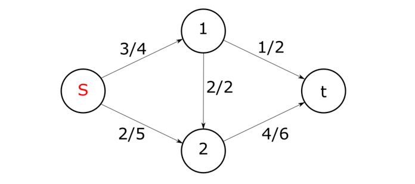
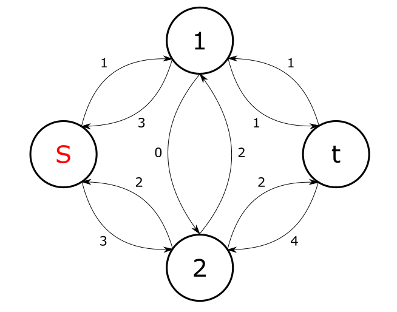

## Потоки

1. Сеть (flow network) $G=(V,E)$ — ориентированный граф, в котором каждое ребро $(u,v)\in E$ имеет положительную пропускную способность ( capacity) $c(u,v)>0$. Если $(u,v)\notin E$, предполагается что $c(u,v)=0$.

В транспортной сети выделяются две вершины: исток $s$ и сток $t$.

2. Поток (flow) $f$ в $G$ — действительная функция $f:V×V→R$, удоволетворяющая условиям:
    
    a) $f(u,v)=−f(v,u)$ (антисимметричность);

    b) $f(u,v)\leq c(u,v)$ (ограничение пропускной способности), если ребра нет, то $f(u,v)=0$;

    c) $\sum_v f(u,v)=0$
    для всех вершин $u$, кроме $s$ и $t$ (закон сохранения потока).

    Величина потока $f$ определяется как $|f|=\sum_{v\in V}f(s,v)$.

### Пример

Первое число означает величину потока, второе — пропускную способность ребра. 

Отрицательные величины потока не указаны (так как они мгновенно получаются из антисимметричности; пункт a). 

Сумма входящих рёбер везде (кроме s и t) равна сумме исходящих и на то, что в общем c(u,v)≠c(v,u). 

Кроме того, величина потока на ребре никогда не превышает пропускную способность этого ребра.

Величина потока в этом примере равна 3+2=5 (считаем от вершины s).

## Дополняющая сеть

1. Остаточной пропускной способностью (residual capacity) ребра $(u,v)$ называется величина дополнительного потока, который мы можем направить из $u$ в $v$, не превысив пропускную способность $c(u,v)$. Иными словами $c_f(u,v)=c(u,v)−f(u,v)$.

2. Для заданной транспортной сети $G=(V,E)$ и потока f, остаточной сетью, (дополняющая сеть, residual network) в $G$, порожденной потоком $f$, является сеть $G_f=(V,E_f)$, где $E_f={(u,v)∈V×V∣c_f(u,v)>0}$

3. Для заданной транспортной сети $G=(V,E)$ и потока $f$ дополняющим путем (augmenting path) $p$ является простой путь из истока в сток в остаточной сети $G_f=(V,E_f)$

